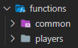
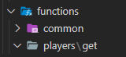

# Common API

The following chapters describe the creation and usage of a new api. With the common api their are 3 actions available in the first chapter those will be described.

## Get data

The first action that can be used is the get action. It can be used to read data from a list and finding a specific item by id property.

### Steps

To create a new api to find data it is recommended to create a new subdirectory in the `api/functions` directory. For example the directory players could be created to find data of a player.



Next it is recommended to create a directory for this specific action. Here this would be get. So we now have the following structure:



Now we can create a new file in this directory. We name it `specific.mcfunction` because we want to request a player by a specific id with this endpoint. The id will later be transmitted with a scoreboard. We asume for this example, that the players data is saved in the `api:players` storage at the path `list`. For now the following code can be added to the created file:

```mcfunction
data modify storage api:common get set from storage api:players list
function api:common/get
execute if data storage api:common result run data modify storage api:players specific set from storage api:common result
```

The code above does the following things:

1. It copies the data from the `api:players list` storage to the `api:common get` storage.
2. It calls the `api:common/get` function to find the specific item by id. This is saved in the `api:common result` storage by the common api.
3. If the result is not empty, it copies the result to the `api:players specific` storage. From here the data can be extracted.

### Usage

Now we already can use this function to request data from the players data. The following code can be used anywhere to request the data of a player with the id 1:

```mcfunction
scoreboard players set #id temp 1
function api:players/get/specific
```

## Save changes

The second action that can be used is the save action. It can be used in combination with the get action to save object changes to the list.

### Steps

Because the players directory has already been created in the previous chapter, we can use it again. The following code can be added to the `api/functions/players/save/specific.mcfunction` file:

```mcfunction
data modify storage api:common save set from storage api:players list
data modify storage api:common payload set from storage api:players specific
function api:common/save
data modify storage api:players list set from storage api:common save
```

The code above does the following things:

1. It copies the data from the `api:players list` storage to the `api:common save` storage.
2. It copies the data from the `api:players specific` storage to the `api:common payload` storage.
3. It calls the `api:common/save` function to save the changes to the list. This replaces the object with the specified id from the list with the object from the payload.
4. It copies the data from the `api:common save` storage to the `api:players list` storage.

### Usage

Now it can be used to save changes to the players data. For example we could change the name of the player with the id 1 to "Test":

```mcfunction
scoreboard players set #id temp 1
function api:players/get/specific
data modify storage api:players specific Name set value "Test"
function api:players/save/specific
```

The code above first requests the data of the player with the id 1. Then it changes the name of the player to "Test". Finally it saves the changes to the list.

## Delete data

The third action that can be used is the delete action. It can be used to remove a specific item from the list.

### Steps

Again we can just create a new file `specific.mcfunction` in the `api/functions/players/delete` directory. The following code can be added to the file:

```mcfunction
data modify storage api:common delete set from storage api:players list
scoreboard players operation #id temp = #removeId temp
function api:common/delete
data modify storage api:players list set from storage api:common delete
```

The code above does the following things:

1. It copies the data from the `api:players list` storage to the `api:common delete` storage.
2. It copies the id from the `#removeId temp` scoreboard to the `#id temp` scoreboard. The `#removeId` is a safety feature to prevent that the wrong item is deleted. How to use it is described in the next chapter.
3. It calls the `api:common/delete` function to delete the item with the specified id from the list.
4. It copies the data from the `api:common delete` storage to the `api:players list` storage.

### Usage

Finally we can use this function to delete a player from the list. For example we could delete the player with the id 1:

```mcfunction
scoreboard players set #removeId temp 1
function api:players/delete/specific
```

Of course we would never delete a player from the list. But this is just an example. It could be used for example to remove party-requests from a list inside a player object.
